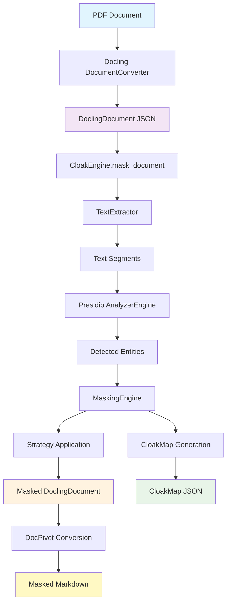
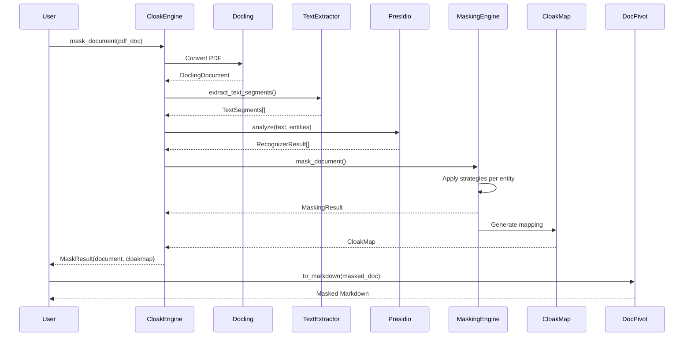
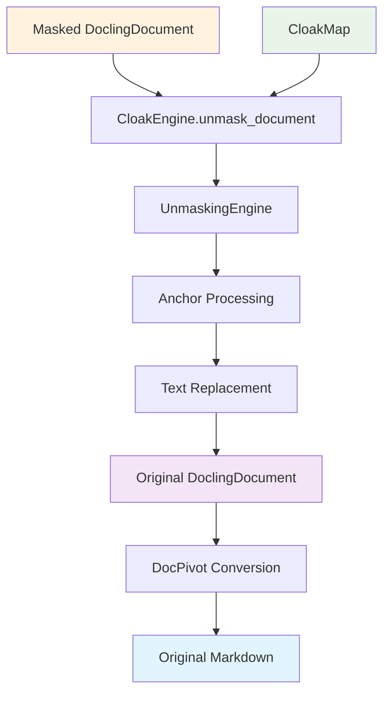
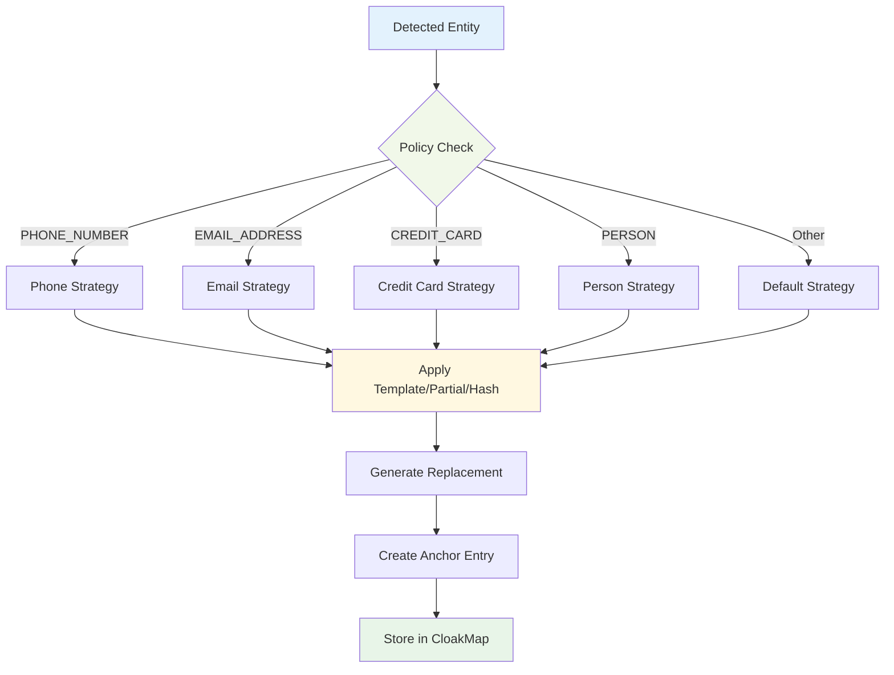
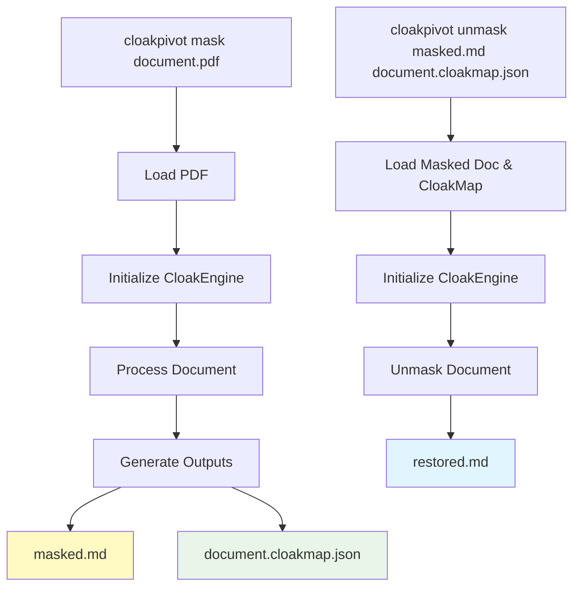
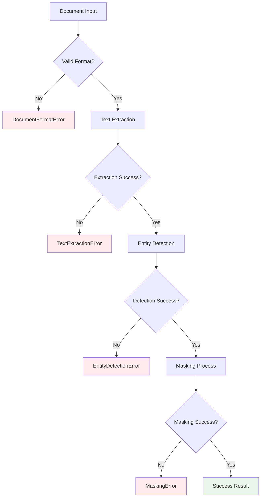
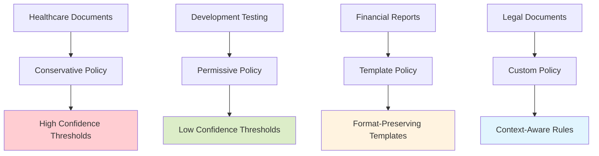

# CloakPivot Workflow Diagrams

This document provides visual representations of CloakPivot's document processing workflows, showing how documents flow through the system from input to masked output and back to original content.

## Core Document Processing Workflow

### PDF → JSON → Masked JSON → Masked Markdown



### Detailed Processing Steps



## Unmasking Workflow

### Masked JSON + CloakMap → Original JSON → Original Markdown



## Strategy Application Flow

### How Different PII Types Are Processed



## CloakMap Structure and Usage

### CloakMap Components

```mermaid
graph TD
    A[CloakMap] --> B[Document Metadata]
    A --> C[Anchor Entries]
    A --> D[Policy Snapshot]
    A --> E[Security Features]
    
    B --> B1[doc_id]
    B --> B2[doc_hash]
    B --> B3[created_at]
    
    C --> C1[AnchorEntry[]]
    C1 --> C2[original_text]
    C1 --> C3[masked_value]
    C1 --> C4[position_info]
    C1 --> C5[entity_type]
    
    D --> D1[strategies_used]
    D --> D2[thresholds]
    D --> D3[locale]
    
    E --> E1[encryption]
    E --> E2[signatures]
    E --> E3[presidio_metadata]
    
    style A fill:#e8f5e8
    style C1 fill:#fff3e0
```

## CLI Workflow

### Command Line Usage Flow



## Builder Pattern Configuration

### CloakEngine.builder() Flow

```mermaid
graph TD
    A[CloakEngine.builder()] --> B[CloakEngineBuilder]
    
    B --> C[.with_languages(['en', 'es'])]
    C --> D[.with_confidence_threshold(0.9)]
    D --> E[.with_custom_policy(policy)]
    E --> F[.with_conflict_resolution(config)]
    F --> G[.build()]
    
    G --> H[Configured CloakEngine]
    
    style A fill:#e3f2fd
    style H fill:#f3e5f5
```

## Error Handling and Validation

### Document Processing Error Flow



## Performance Optimizations (PR-013)

### Optimized Processing Pipeline

```mermaid
graph TD
    A[Text Processing] --> B[O(n) Algorithm]
    B --> C[List Concatenation]
    C --> D[Efficient Replacement]
    
    E[Strategy Mapping] --> F[LRU Cache]
    F --> G[128 Entry Limit]
    G --> H[2x-5x Speedup]
    
    I[Document Building] --> J[Batch Operations]
    J --> K[Memory Efficiency]
    
    style B fill:#c8e6c9
    style F fill:#c8e6c9
    style J fill:#c8e6c9
```

## Integration Patterns

### Common Usage Patterns



---

## Legend

- 🔵 **Blue**: Input documents and original content
- 🟣 **Purple**: DoclingDocument JSON format
- 🟠 **Orange**: Masked content
- 🟢 **Green**: CloakMap and mapping data
- 🟡 **Yellow**: Output formats (Markdown, etc.)
- 🔴 **Red**: Error states and validation failures

## Key Concepts

### Document Flow States
1. **Original**: Unprocessed document with PII
2. **Analyzed**: Entities detected but not yet masked
3. **Masked**: PII replaced with strategies, CloakMap generated
4. **Exported**: Converted to target format (Markdown, JSON, etc.)
5. **Restored**: Original content restored using CloakMap

### Processing Guarantees
- **Reversibility**: Perfect restoration using CloakMap
- **Structure Preservation**: Document layout and formatting maintained
- **Security**: Optional encryption and signing of CloakMaps
- **Performance**: Optimized algorithms for large documents
- **Flexibility**: Configurable policies and strategies per entity type